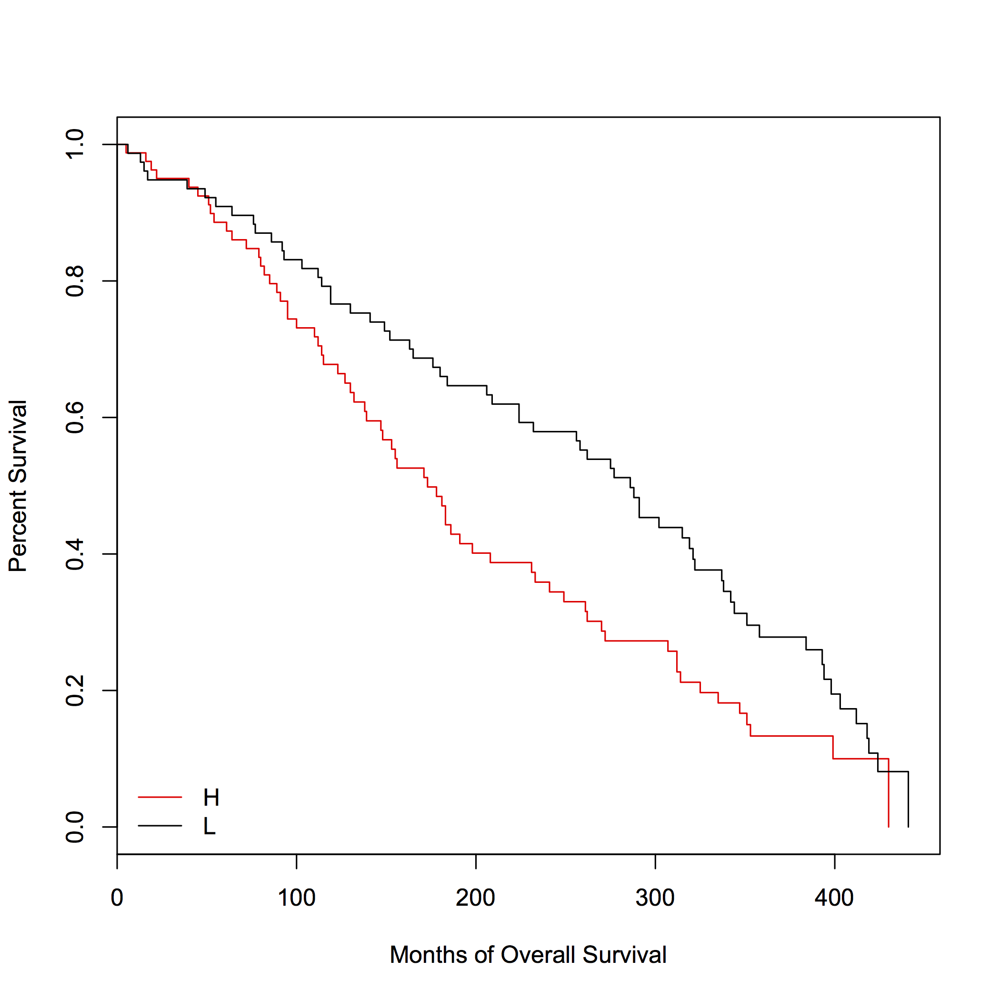

# TCGA Glioblastoma Gene Signature Analysis 

## Summary

Provisional 2013 TCGA glioblastoma RNAseq expression data were subjected to survival 
signature risk score identification analysis [1, 2]. Expression data were normed and 
then averaged for individuals with multiple measurements. After verifying proportionality
of hazards, a Cox proportional hazards model was fit to the 19 signature genes with
overall survival status as the outcome. Risk scores for each participant was determined
using the method by [2]. Risk scores were than categorized as Low or 
High using  0 as the cutpoint . Differential survival 
between the Low and High gene signature risk groups were visualized using 
Kaplan-Meier curves and difference between the curves was assessed via the log-rank test. 
All gene signature analyses were performed in R. 

[1] Li, H. \& Gui, Jiang. (2004). Partial Cox regression analysis for high-dimensional 
microarray gene expression data. Bioinformatics, 20, i208-i215. 
doi: 10.1093/bioinformatics/bth900\\

[2] Lu, Y., Lemon, W, Liu, P., Yi, Y., Morrion, C., Yan, P., Sun, Z., Szoke, J., 
Gerald, W., Watson, M, Govindan, R., \& You, M. (2006). A Gene Expression Signature 
Predicts Survival of Patients with Stage I Non-Small Cell Lung Cancer. 
PLOS Medicine, https://doi.org/10.1371/journal.pmed.0030467. 



## Reproducibility and Data

The data can be downloaded using this link: 
http://www.cbioportal.org/study?id=gbm_tcga#summary. Alternatively, to download the data 
and reproduce all analyses: 

```
bash data/data_files.sh

Rscript scripts/surv_gene_sig.R
```
## Contact 

* About the code: Lia Harrington (lia.x.harrington.gr@dartmouth.edu)

* About the project or collaboration: Dr. Mark Israel (mark.a.israel@dartmouth.edu) 
and Damian Almiron (damian.a.almiron.gr@dartmouth.edu)